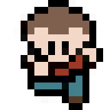

# pixel-rpg-game
JavaScript RPG game

# toDo list

- Different ways to simulate movement of main character:

  - (different sprite images) => {Change in the js the img.src of html} (done) (optimization pending)
  - (canvas) => {Change canvas in js}
  - (svg) => {Change svg in js}
  - (ccs) => {Change css}

- Different ways to simulate movement of main character trough tiled map:
